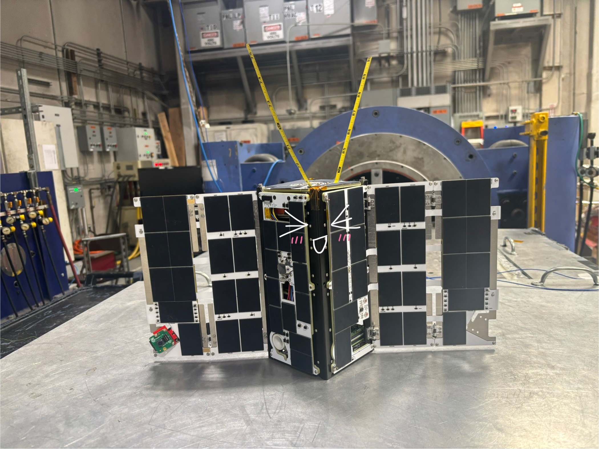
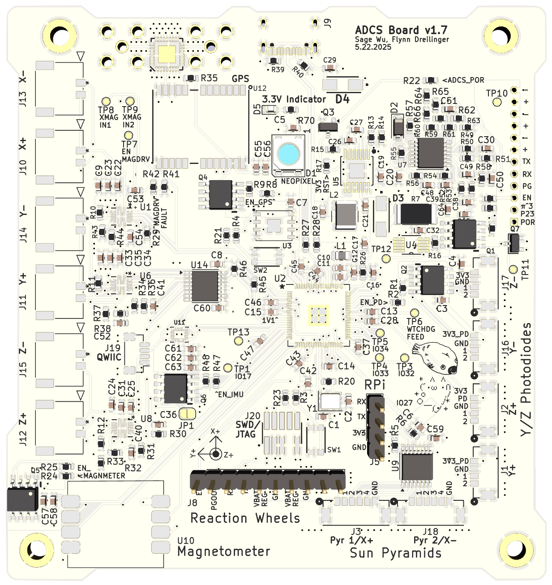

# SAMWISE ADCS Flight Software

<div align="center">
  
  <p><em>SAMWISE at its vibe test in June 2025</em></p>
</div>

This repo contains the Flight Software for the SAMWISE Attitude Determination and Control System (ADCS) board. This system determines and controls the SAMWISE's attitude in space.

<div align="center">
  
  <p><em>ADCS flight board v1.7</em></p>
</div>

## System Overview

The ADCS flight software is built around a **task-based state machine** that manages different operational modes and their associated control algorithms. The system prioritizes safe operation through a hierarchical state structure.

### Core Architecture

<div align="center">
  
  <p><em>ADCS Flight Software Architecture Overview</em></p>
</div>

The flight software is organized into **three main categories** that work together:

## 1. 🔧 Hardware Drivers (`drivers/`)
Low-level interfaces to sensors and actuators - the bridge between software and hardware.

**Key Components:**
- **Sensors**: `magnetometer.cpp`, `imu.cpp`, `gps.cpp`
- **Actuators**: `magnetorquer.cpp`, `pwm_driver.c` (reaction wheels)  
- **Support**: `neopixel.cpp`, `watchdog.cpp`, `adm1176.cpp` (power monitor)

## 2. 🧮 GNC Algorithms (`gnc/`)
Guidance, Navigation, and Control - the mathematical brain of the ADCS system.

**Key Components:**
- **Control**: `bdot.cpp` (magnetic detumbling), `desaturation.cpp`
- **Estimation**: `attitude_filter.cpp`, `sun_vector.cpp`
- **Utilities**: `matrix_utils.cpp`, `attitude_dynamics.cpp`

## 3. ⚙️ Software Tasks (`tasks/` + `scheduler/`)
Task execution and state management - orchestrates when and how things happen.

**Key Components:**
- **Core Tasks**: `sensors_task.cpp`, `bdot_task.cpp`, `telemetry_task.cpp`
- **State Machine**: `scheduler.cpp`, `states/*.cpp`

### ADCS Control Hierarchy (Priority Order)

<div align="center">
  
  <p><em>ADCS State Machine: Priority-based transitions ensure safe operation</em></p>
</div>

The system follows a safety-first approach with states prioritized by criticality:

1. **Detumbling** (Highest Priority)
   - **Purpose**: Reduce dangerous rotation rates using magnetic field interaction
   - **Requirements**: Magnetometer + magnetorquers only
   - **Algorithm**: B-dot control (proportional or bang-bang)
   - **Trigger**: Angular velocity > 10°/s
   - **Exit**: Angular velocity < 1°/s

2. **Attitude Determination** (Medium Priority)
   - **Purpose**: Determine spacecraft orientation using sensor fusion
   - **Requirements**: Magnetometer, sun sensors, IMU, GPS
   - **Algorithms**: MRP EKF, B field model, sun vector model, attitude glue logic

3. **Attitude Control** (Lower Priority)
   - **Nadir Pointing**: Point camera toward Earth
   - **Slewing**: Controlled rotation to target attitude
   - **Requirements**: Full sensor suite + reaction wheels + magnetorquers

4. **Reaction Wheel Desaturation** (Lower Priority)
   - **Purpose**: Unload excess angular momentum from reaction wheels
   - **Method**: Transfer momentum to magnetorquers
   - **Trigger**: Wheel speed > saturation threshold

# Directory Structure
* **Top Level**: Main file and general utilities (type definitions, macros, linear algebra library, etc.)
* `drivers`: Functions for interacting directly with hardware (IMU, GPS, magmetometers, etc.)
* `gnc`: Math routines for control functions (attitute estimation, control, etc.)
* `scheduler`: Core of the software called directly by `main` - handles state transitions and dispatches tasks
### State Machine:
* `states`: Contains `.cpp` and `.h` files for each operational state. Each state defines which tasks to run and transition logic.
* `tasks`: Contains modular functions dispatched by the scheduler. Tasks include sensor reading, control algorithms, telemetry, and system monitoring.

### Current State Definitions

- **`init`**: Boot state that initializes hardware and transitions to detumble
- **`detumble`**: B-dot control to reduce rotation rates (sensors + bdot + telemetry + watchdog)
- **`slewing`**: Placeholder for attitude control operations (sensors + telemetry + watchdog)
- **`cool_down`**: Safe mode for excessive rotation rates (sensors + telemetry only)
- **`test`**: Hardware validation and testing routines

### Key Task Functions

- **`sensors_task`**: Reads all sensor data (magnetometer, IMU, GPS, sun sensors, power monitor)
- **`bdot_task`**: Executes magnetic detumbling control algorithm
- **`telemetry_task`**: Manages communication with main spacecraft computer
- **`watchdog_task`**: System health monitoring and safety checks

## Build Products
For the latest build products, check `actions -> C build -> samwise-adcs-products.zip`.

## Getting Started

For comprehensive onboarding instructions including development environment setup and workflows, see [ONBOARDING.md](ONBOARDING.md).

Quick setup:

Run `source configure.sh` for initial repository setup.

**Note: Only Mac and Linux are supported. If you are on Windows, create a Linux VM**

## Building Instructions
Create a `build` folder:
```
mkdir build
```

Enter the `build` folder:
```
cd build
```

Run `cmake` (Note: this is usually only necessary if you have added, moved, or deleted files):
```
cmake ..
```

Make the project:
```
make -j8
```

Upload the project to your device
```
picotool load samwise-adcs.uf2 -f
```

Follow instructions [here](https://www.raspberrypi.com/documentation/microcontrollers/c_sdk.html#blink-an-led) for how to drag the `.uf2` file onto your device.

### Useful Links
* [ADCS Board Avionics Doc](https://docs.google.com/document/d/1kCIeIKDs0vaQMCwJgZbtulsbNorGdGYH6ISKnDgNObU/edit?usp=drive_open&ouid=102158912597992844372)
* [Picubed Flight Software Repo](https://github.com/stanford-ssi/samwise-flight-software)
* [ADCS Simulations Repo](https://github.com/stanford-ssi/samwise-adcs-sims)