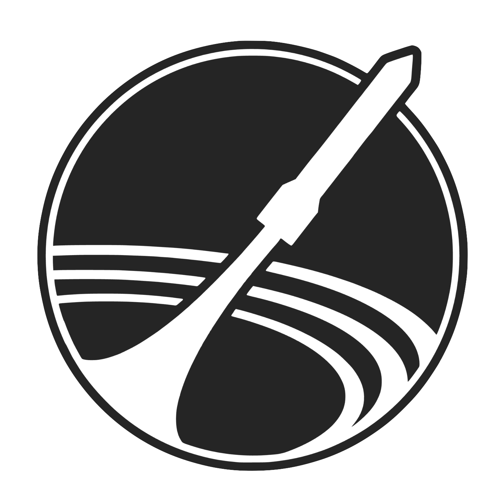

# SAMWISE ADCS Flight Software 

<div align="center">
  
  <p><em>SAMWISE at his vibe test in June 2025</em></p>
</div>

Flight software for the SAMWISE Attitude Determination and Control System (ADCS) board.

## System Overview

Task-based state machine managing spacecraft attitude control through hierarchical operational modes.

<div align="center">
  
  <p><em>ADCS flight board v1.7</em></p>
</div>

## Architecture

### 🔧 Hardware Drivers
Low-level sensor and actuator interfaces.
- **Sensors**: Magnetometer, IMU, GPS, Sun sensors
- **Actuators**: Magnetorquers, PWM control
- **Support**: Power monitor, Watchdog, Status LED

### 🧮 GNC Algorithms  
Mathematical control and estimation functions.
- **Control**: B-dot detumbling, Desaturation
- **Estimation**: Attitude filter, Sun vector calculation
- **Utilities**: Matrix operations, Attitude dynamics

### ⚙️ Software Tasks
Task scheduling and state management.
- **Core Tasks**: Sensors, Control, Telemetry, Watchdog
- **State Machine**: Scheduler with priority-based transitions

## Control Hierarchy

1. **Detumbling** - Reduce dangerous rotation using magnetic control
2. **Attitude Determination** - Sensor fusion for orientation estimation  
3. **Attitude Control** - Pointing and slewing operations
4. **Desaturation** - Reaction wheel momentum management

## States

- **init** - Hardware initialization and validation
- **detumble** - B-dot magnetic damping control
- **slewing** - Attitude control operations  
- **cool_down** - Safe mode for fault conditions
- **test** - Hardware validation routines

## Quick Start

```bash
source configure.sh     # Initial setup
mkdir build && cd build
cmake .. && make -j8
picotool load samwise-adcs.uf2 -f
```

**Requirements:** Mac/Linux only. Windows users create Linux VM.

## Links
- [Build Products](https://github.com/stanford-ssi/samwise-adcs-flight/actions)
- [ADCS Board Doc](https://docs.google.com/document/d/1kCIeIKDs0vaQMCwJgZbtulsbNorGdGYH6ISKnDgNObU/edit)
- [PyCubed Flight Software](https://github.com/stanford-ssi/samwise-flight-software)
- [ADCS Simulations](https://github.com/stanford-ssi/samwise-adcs-sims)
