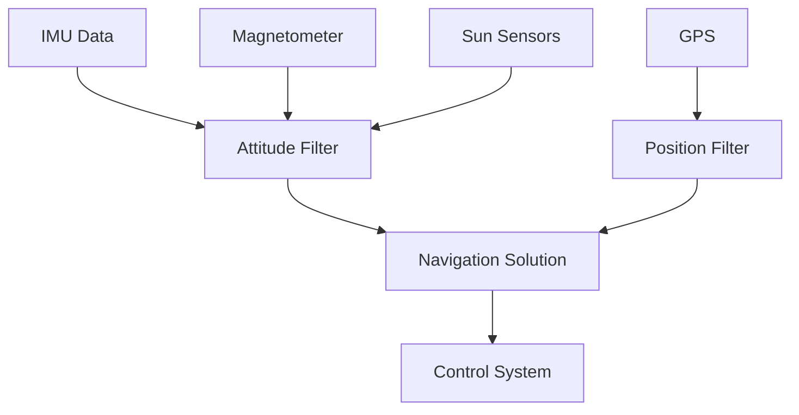

# Sensor Integration

The SAMWISE ADCS integrates multiple sensors to determine satellite attitude and position with high accuracy. This page covers the sensor suite, calibration procedures, and data fusion algorithms.

## Sensor Suite Overview

### Inertial Measurement Unit (BMI270)
- **Angular velocity**: ±2000°/s, 16-bit resolution
- **Linear acceleration**: ±16g, 16-bit resolution  
- **Sample rate**: 100 Hz with hardware FIFO
- **Interface**: I2C at 400 kHz
- **Power consumption**: 685 μA typical

### Magnetometer (TBD)
- **Range**: ±8 Gauss (Earth's field ~0.5 Gauss)
- **Resolution**: 12-bit per axis
- **Sample rate**: 10 Hz
- **Temperature compensation**: Built-in
- **Interface**: I2C

### Sun Sensors
- **Type**: Photodiode arrays with analog processing
- **Field of view**: ±60° per sensor
- **Accuracy**: 0.1° under ideal conditions
- **Number**: 6 faces for full coverage
- **Interface**: ADC via ADS7830

### GPS Module
- **Constellation**: GPS + GLONASS
- **Accuracy**: 2.5m CEP typical
- **Update rate**: 1 Hz position, 0.1 m/s velocity
- **Interface**: UART at 9600 baud
- **Cold start**: <30 seconds

## Data Processing Pipeline

### Raw Data Acquisition
```cpp
struct SensorReading {
    uint32_t timestamp_us;
    Vector3 gyro_dps;          // degrees/second
    Vector3 accel_mg;          // milli-g
    Vector3 mag_gauss;         // Gauss
    Vector3 sun_angles_deg;    // degrees from sensor normal
    GpsData gps;               // position, velocity, time
    float temperature_c;        // sensor temperature
};
```

### Calibration Corrections

#### IMU Calibration
The IMU requires bias and scale factor corrections:

$$\vec{g}_{corrected} = S_g(\vec{g}_{raw} - \vec{b}_g)$$

$$\vec{a}_{corrected} = S_a(\vec{a}_{raw} - \vec{b}_a)$$

Where:
- $S_g$, $S_a$ are 3×3 scale factor matrices
- $\vec{b}_g$, $\vec{b}_a$ are bias vectors
- Temperature compensation applied to both

#### Magnetometer Calibration  
Magnetometer data requires hard and soft iron correction:

$$\vec{m}_{corrected} = A(\vec{m}_{raw} - \vec{b}_m)$$

Where:
- $A$ is the 3×3 soft iron correction matrix
- $\vec{b}_m$ is the hard iron bias vector

### Sensor Fusion Architecture



## Attitude Determination

### Extended Kalman Filter (EKF)
The attitude EKF estimates:
- **Quaternion attitude** (4 states)
- **Angular velocity bias** (3 states)  
- **Total**: 7 states with 6×6 covariance matrix

#### State Vector
$$\vec{x} = \begin{bmatrix} q_0 \\ q_1 \\ q_2 \\ q_3 \\ b_x \\ b_y \\ b_z \end{bmatrix}$$

#### Process Model
$$\dot{q} = \frac{1}{2}q \otimes (\vec{\omega} - \vec{b})$$

$$\dot{b} = \vec{w}_b$$

Where $\vec{w}_b$ is the gyro bias random walk.

#### Measurement Updates

**Magnetometer Update:**
- Reference: IGRF magnetic field model
- Innovation: $\vec{z} = \vec{m}_{body} - C(\hat{q})\vec{m}_{ECEF}$

**Sun Sensor Update:**
- Reference: Ephemeris sun vector
- Innovation: $\vec{z} = \vec{s}_{body} - C(\hat{q})\vec{s}_{ECI}$

## Sensor Health Monitoring

### Failure Detection
```cpp
enum SensorHealth {
    SENSOR_HEALTHY,
    SENSOR_DEGRADED,
    SENSOR_FAILED
};

struct HealthMetrics {
    float innovation_magnitude;
    float bias_drift_rate;
    uint32_t dropout_count;
    SensorHealth status;
};
```

### Built-in Tests (BIT)
- **Range checks**: Verify sensor readings within expected bounds
- **Rate checks**: Detect unrealistic changes between samples
- **Consistency checks**: Cross-validate between sensors
- **Stuck data detection**: Monitor for repeated identical readings

### Graceful Degradation
When sensors fail, the system automatically reconfigures:

| Failed Sensor | Backup Strategy |
|---------------|----------------|
| IMU | Magnetometer + sun sensors only |
| Magnetometer | IMU + sun sensors, reduced accuracy |
| Sun sensors | IMU + magnetometer, blind pointing |
| GPS | Last known orbit + propagation |

## Calibration Procedures

### Ground Calibration
1. **IMU**: Six-position static calibration for bias/scale
2. **Magnetometer**: 3D figure-8 maneuvers in known field
3. **Sun sensors**: Laboratory sun simulator with known angles
4. **System**: End-to-end attitude accuracy verification

### In-Flight Calibration
- **Gyro bias**: Continuous estimation during stable periods
- **Magnetometer**: Automatic bias update using field magnitude
- **Sun sensors**: Cross-calibration against ephemeris data

## Performance Specifications

| Parameter | Requirement | Typical Performance |
|-----------|-------------|-------------------|
| Attitude knowledge | 1° (3σ) | 0.3° (3σ) |
| Angular rate knowledge | 0.1°/s (3σ) | 0.05°/s (3σ) |
| Position accuracy | 10 m (3σ) | 2.5 m (3σ) |
| Velocity accuracy | 0.1 m/s (3σ) | 0.05 m/s (3σ) |
| Update rate | 20 Hz | 50 Hz |

The integrated sensor suite provides robust, accurate navigation data for precise attitude control and mission operations.